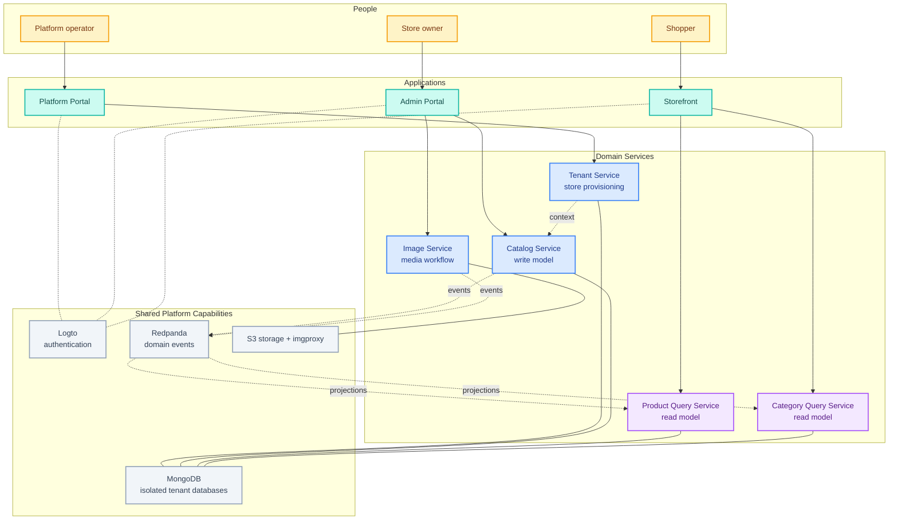

# Option B: Layered Platform

This version highlights the boundary between user-facing applications, domain services, and shared
platform capabilities.

**Best for:** technical clients who want a concise systems-architecture view without deployment
details.
