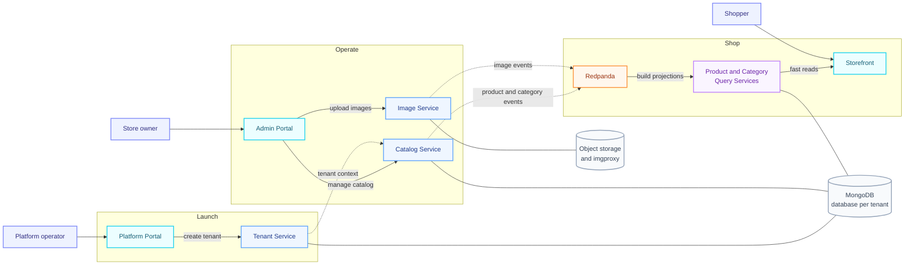

# Option A: Store Lifecycle

This version presents the platform as a clear lifecycle: create a store, manage its catalog, then
serve shoppers through fast read models.

**Best for:** clients who should understand the product in seconds, without needing to know CQRS.
