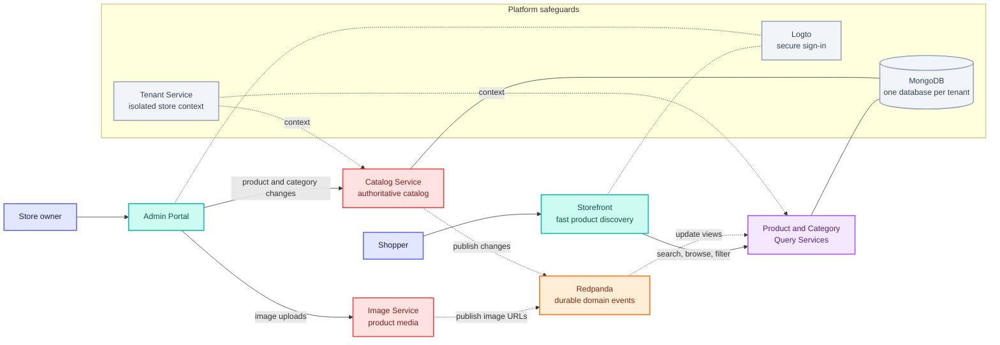

# Option C: From Merchant Action to Shopper Experience

This version focuses on the platform's value chain: a merchant changes the catalog and shoppers
receive an optimized storefront experience.

**Best for:** Upwork proposals where the main message is business impact: independent stores,
reliable catalog updates, and fast shopper-facing reads.
