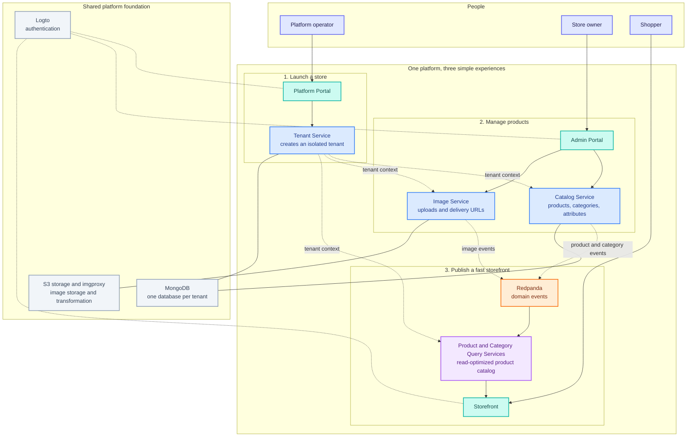

# How the Platform Works

The platform lets a merchant launch and operate an isolated online store while shoppers browse a
fast, read-optimized storefront.

**Tenant isolation:** A tenant is provisioned once and its context travels with every request.
Tenant data is stored in a dedicated MongoDB database, while the platform remains a shared SaaS
deployment.

**Fast storefronts:** Catalog changes are published as events and projected into dedicated query
services. Shoppers read from those optimized models rather than from the write service.
