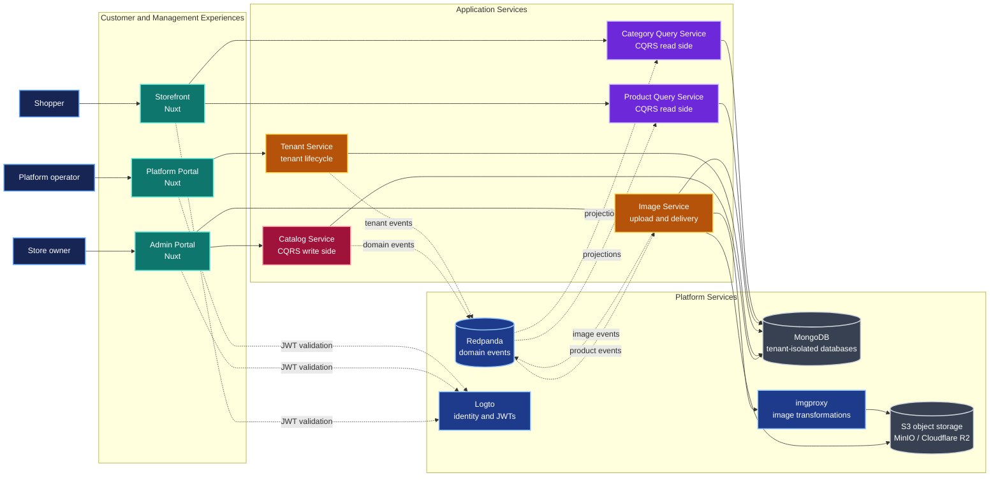

# Platform Architecture

This multi-tenant SaaS platform combines Go microservices, Nuxt applications, CQRS read models,
and asynchronous domain events. Each tenant's data is isolated in its own MongoDB database while
all tenants share the same deployment.

**Why it matters:** Catalog writes are separated from storefront reads. Domain events build
independent, optimized query models, allowing the storefront to scale without synchronous calls to
