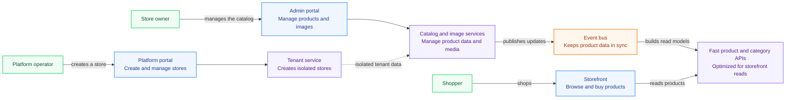

# Platform Overview for Portfolio

This diagram is a simplified, client-facing view of the platform. It focuses on what each user
can do and how the platform turns catalog changes into a fast storefront experience.

**Built-in platform capabilities:** tenant-isolated data, authentication, image processing,
observability, and Kubernetes deployment.

**Technical implementation:** Go microservices, Kafka/Redpanda events, MongoDB, gRPC/Protobuf,
Docker, Kubernetes, Grafana, Tempo, and Loki.
