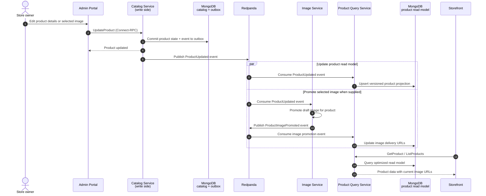

# Product Update Flow

This flow shows how a product change reliably reaches the storefront without coupling read traffic
to the Catalog Service. The Catalog Service stores both the product change and its event in one
MongoDB transaction; the transactional outbox then publishes the event for independent consumers.

**Reliability:** The transactional outbox prevents a database update from being committed without
its corresponding domain event. Projection handlers use event versions, so delayed or out-of-order
messages do not overwrite newer storefront data.

**Trade-off:** The storefront is eventually consistent after a write. In return, read models remain
independent, fast, and horizontally scalable.
